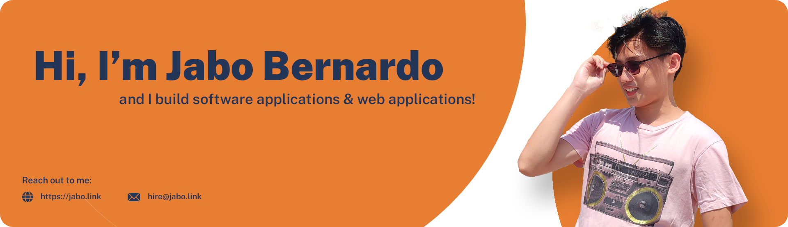

### 👋 Introduction

Hey, I am a Full-Stack Web Developer based on the Philippines with over 4 years of experience in programming. Web development experience including TypeScript, JavaScript, Node.js, React.js, MongoDB, Postgres, Amazon Web Services, and Microsoft Azure.

### 🔦 Highlights
- Conceptualized & built a website similar to Fiverr from front-end to back-end with over 1000 registered users and 500K+ requests a month
- Developed a game engine ([Kree Java](https://github.com/jabo-bernardo/Kree-Java)) from scratch written in Java that was featured in various blog websites
- Contributed to various open source projects here in Github 
- Created a github organization solely for providing boilerplate codes ([github.com/Voilerplates](https://github.com/Voilerplates))

### 🗣 Languages I speak
- Java    
- C#
- JavaScript
- Python
- TypeScript
- C++/C

### ⚙ Technologies I use
- Front-end development: React, Next.js, Vue.js, Svelte
- Back-end development: Express, Nest.js, Java Springboot

### 📮 Reach out to me
Twitter: [@jabo_bernardo](https://twitter.com/jabo_bernardo)  
Email: [hire@jabo.link](mailto:hire@jabo.link) / [joelvincent.work@gmail.com](mailto:joelvincent.work@gmail.com)  
LinkedIn: [@jabo-bernardo](mailto:https://www.linkedin.com/in/jabo-bernardo/)  
Discord: Jabo#7775  
Website: [jabo.link](https://jabo.link)
